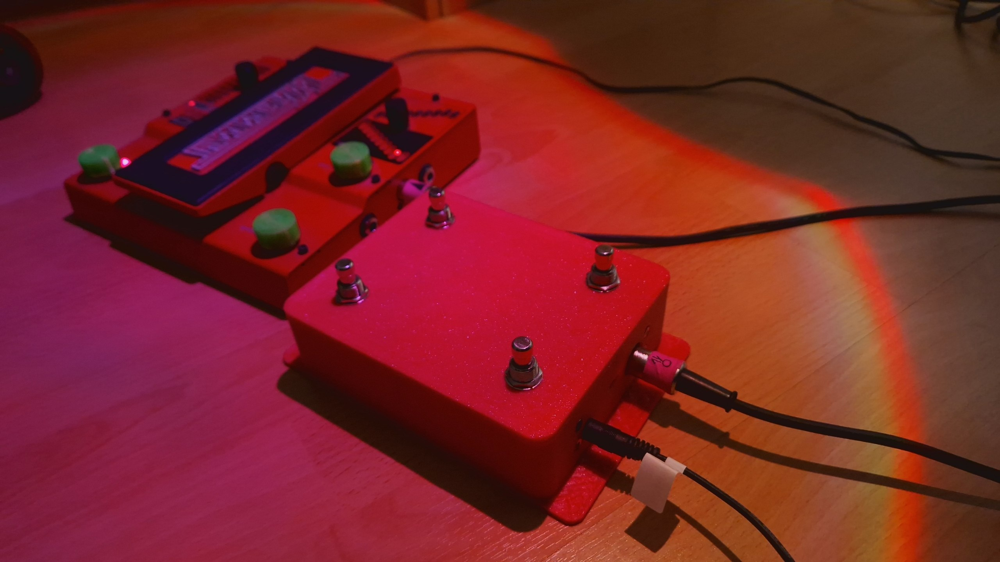

# MIDI Whammy Controller

ESP32-based MIDI foot controller. Four footswitches send Program Change
messages over MIDI, grouped in pairs that scroll up/down through a preset
range, with long-press auto-repeat.

Video demo:
Instagram - https://instagram.com/reel/DdcA3nrou3H/?utm_source=ig_web_copy_link&stkn=NTc4MTIwNjQ2YQ==
Youtube - https://youtu.be/dJB8F6dx3rw

## Setup

1. **Install VS Code** — download and install from
   [code.visualstudio.com](https://code.visualstudio.com/).
2. **Add PlatformIO** — open VS Code, go to the Extensions panel
   (`Ctrl+Shift+X`), search for "PlatformIO IDE", and install it. Restart VS
   Code when prompted.
3. **Open the project** — `File > Open Folder...` and select this repo's
   folder. PlatformIO will detect `platformio.ini` automatically.
4. **Build** — click the PlatformIO checkmark icon in the bottom status bar,
   or run `pio run` in the terminal.
5. **Flash** — connect the board over USB, click the right-arrow (Upload)
   icon in the status bar, or run `pio run -t upload`.

Pin assignments and MIDI settings live in [`src/config.h`](src/config.h).
